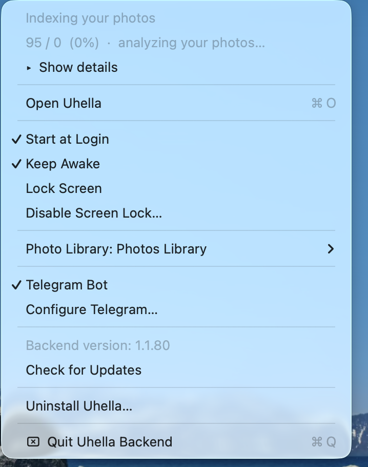

# Uhella Backend User Guide

Uhella Backend is the small Mac app that runs the Uhella server on your Mac.

It is **free**.

---

## Installation

For the **first install**, download the **.dmg** and install Uhella Backend like a normal Mac app.

After you open it, Uhella shows a **simple step-by-step setup window**. It guides you through everything with a normal Mac UI.

No terminal. No manual server setup.

If macOS asks for **Photos access**, allow it.

The first setup can take some time because it may need to download several GB of files.

---

## Automatic updates

After the first install, Uhella Backend checks for updates automatically every **6 hours**.

By default, it downloads and installs upgrades for you automatically.

---

## Telegram setup

If you want to use Uhella from your phone, set up Telegram inside the app.

Uhella guides you step by step:

1. Create a bot with **@BotFather**
2. Paste the bot token into Uhella
3. Find your Telegram ID with **@userinfobot**
4. Confirm that Telegram messages reach you

There is also an optional step for **large video downloads**.

---

## Daily use

Uhella Backend lives in the **macOS menu bar**.

From there you can use:

- **Open Uhella**
- **Start at Login**
- **Keep Awake**
- **Photo Library**
- **Telegram Bot**
- **Configure Telegram**
- **Check for Updates**
- **Quit Uhella Backend**

If you have more than one Photos library, you can switch libraries there too.

When Uhella has photos or videos ready to move, it can send a Telegram notification with a **Move** button.

---

## Best setup

A Mac that can stay on works well.

A **Mac mini** is an even better choice if you travel a lot or want Uhella available anytime.
